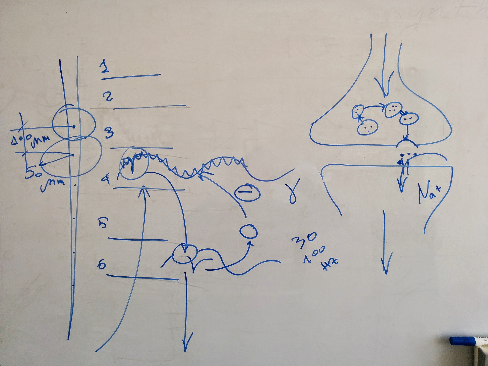
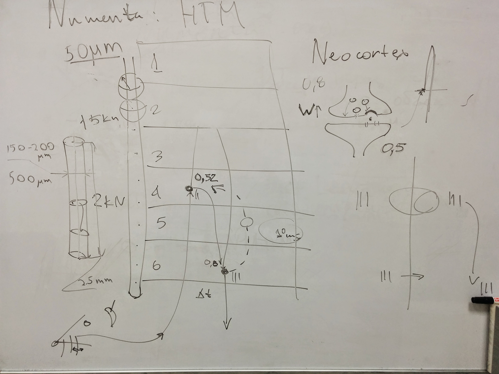

#Spikes

Project to process data from neuroscience lab, to run filtering, clustering and get proper correlations of the neurons firing.

##Description

Neocortex of mammals contains 6 layers. This is been explored with the special probes with 16 sensors.
You can see this as the needle (cylinder) on the picture with dots. Every sensor produces gamma oscillation 30-100 Hz. Every oscillation is the combination of the spikes (impulses) of each and every neuron in the sphere of sensitivity of the sensor that is 50 mkm. As the form of the spike is unique for each cell (neuron) we could sort spikes according to their form. Sorting based on the machine learning techniques is primary goal of the project.

Second goal could be the discovering correlations of the neurons that trigger spikes on different levels and discovering causality of the neurons triggering.

Third goal could be discovering negative feedback connection between neurons of 4th and 6th levels.

##References

###Clustering

1. http://www.ncbi.nlm.nih.gov/pmc/articles/PMC3314330/?tool=pubmed
1. http://www.nature.com/neuro/journal/v7/n5/full/nn1233.html
1. http://jn.physiology.org/content/84/1/401

###Viewers

- [OpenElectrophy](http://neuralensemble.org/OpenElectrophy/)
- [SpykeViewer](http://neuralensemble.org/SpykeViewer/)
- [Stimfit](http://neuro.debian.net/pkgs/stimfit.html)
